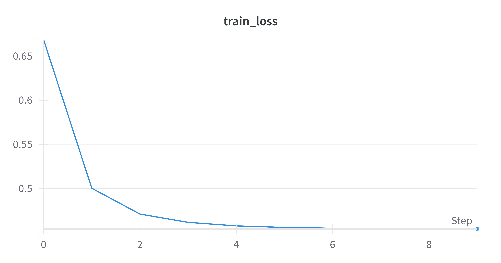
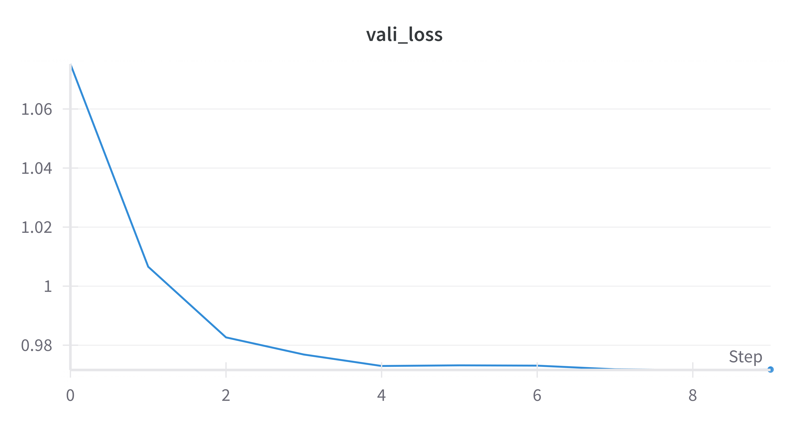
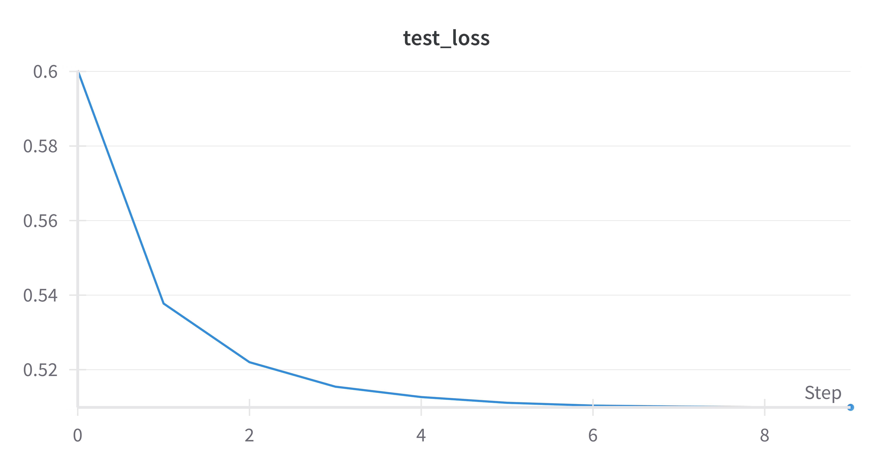

# Part Two: Multilayer Perceptron (MLP)

## Task 1: Model Implementation and Training

### 1.1 Model Design

The model architecture consists of two independent Multilayer Perceptrons (MLPs) designed to predict the trend and seasonal components of the time series data separately. Each MLP has the following structure:

- **Input Layer**: Takes the reshaped time series data.
- **Hidden Layer**: A fully connected layer with ReLU activation.
- **Output Layer**: A fully connected layer without activation, as the task is regression.

The final prediction is the sum of the outputs from the trend and seasonal MLPs.

### 1.2 Implementation Details

The implementation was done using `numpy` to ensure manual computation of gradients. The key steps in the implementation are:

- **Weight Initialization**: He initialization was used for the weights to ensure proper scaling.
- **Forward Propagation**: Computed the hidden layer activations and the final output.
- **Loss Calculation**: Mean Squared Error (MSE) was used as the loss function.
- **Backward Propagation**: Gradients were computed manually and used to update the weights.
- **Gradient Descent**: Naive Gradient Descent was used to update the weights.

### 1.3 Training and Visualization

> [!NOTE]
> The detailed metrics and visualizations can be view at <https://wandb.ai/liblaf-team/MLP_forecaster/runs/mjhdy9sc>.
> The parameters used are from the best run of the hyperparameter tuning.

The model was trained on the ETTh1 dataset, which consists of multivariate time series data. The training process involved:

- **Data Preprocessing**: Decomposing the time series into trend and seasonal components.
- **Training Loop**: Iterating over epochs, computing forward and backward passes, and updating weights.
- **Visualization**: The training and validation loss were plotted over epochs to monitor the model's performance.

###### Training Loss Curve

###### Validation Loss Curve

###### Test Loss Curve

### 1.4 Predictions

Sample predictions from the model are shown below:

###### Good Predictions

###### Bad Predictions

###### Medium Predictions

## Task 2: Hyperparameter Tuning and Evaluation

### 2.1 Hyperparameter Search

> [!NOTE]
> The detailed metrics and visualizations can be view at <https://wandb.ai/liblaf-team/MLP_forecaster/sweeps/xvns5kdq>.

Hyperparameter tuning was performed using Weights & Biases Sweeps with a Bayesian optimization method. The search space included:

- **Batch Size**: `[16, 32, 64]`
- **Hidden Size**: `[256, 512, 1024]`
- **Learning Rate**: Log-uniform distribution between `0.0001` and `0.1`
- **Weight Decay**: Log-uniform distribution between `1e-5` and `0.001`

The best hyperparameters found were:

- **Batch Size**: `16`
- **Hidden Size**: `256`
- **Learning Rate**: `0.09297208328663738`
- **Weight Decay**: `0.0008607234720977175`

### 2.2 Evaluation

The model was evaluated on the test set using the Mean Squared Error (MSE) metric. The test MSE achieved was:

**Test MSE**: `0.5088060239137084`

This result meets the requirement of not exceeding 0.6, indicating that the model performs well on the forecasting task.

### 2.3 Conclusion

The MLP model, despite its simplicity, demonstrated competitive performance in forecasting multivariate time series data. The manual implementation of forward and backward passes provided a deep understanding of the underlying mechanics of neural networks. The hyperparameter tuning process further optimized the model's performance, achieving a satisfactory test MSE.
