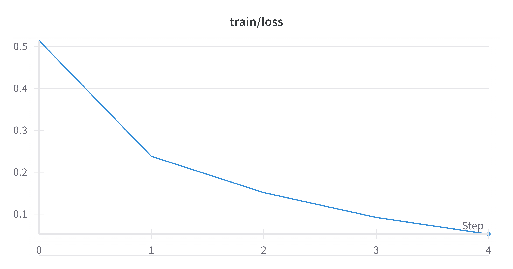
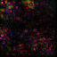
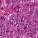

# Part Three: Convolutional Neural Network (CNN)

## Task 1: Training `ResNet-18` from Scratch

### Overview

In this task, we trained a `ResNet-18` model from scratch on the `PathMNIST` dataset for multi-class tissue type classification. The training process was tracked using the W&B experiment management tool, and the model's performance was evaluated on the test set.

### Code Implementation

The code for this task is provided in `task1.py`. The script initializes a `ResNet-18` model, trains it on the `PathMNIST` training set, and evaluates its performance on the validation and test sets. The training process includes logging the training loss and validation metrics (AUC and ACC) using W&B.

### Training and Validation Curves

###### Training Loss Curve

###### Validation AUC Curve

###### Validation ACC Curve

### Test Performance

The model's performance on the test set is as follows:

- **Test AUC**: `0.9803411316742444`
- **Test ACC**: `0.895125348189415`

### W&B Run

The detailed run can be viewed at [W&B Run for Task 1](https://wandb.ai/liblaf-team/hw1/runs/clyarbbv).

### Summary

In this task, we successfully trained a `ResNet-18` model from scratch on the `PathMNIST` dataset. The model's performance was tracked and logged using W&B, and the final test performance was evaluated. The results indicate that the model achieved a satisfactory level of ACC and AUC on the test set.

## Task 2: Visualizing Saliency Maps

### Overview

In this task, we visualized the saliency maps of the `ResNet-18` model trained in Task 1. Saliency maps provide insights into which parts of the input image are most influential in the model's decision-making process. This visualization helps in understanding the model's behavior and identifying areas of interest in the input images.

### Code Implementation

The code for this task is provided in `task2.py`. The script loads the trained `ResNet-18` model and generates saliency maps for a random subset of test images using the Captum library. The saliency maps are then saved as images for further analysis.

### Saliency Map Visualization

Below is an example of the input image and its corresponding saliency map:

| Index | Label |           Input Image            |            Saliency Map             |
| :---: | :---: | :------------------------------: | :---------------------------------: |
| 06099 |   6   |  |  |
| 05839 |   8   |  |  |
| 04568 |   8   |  |  |
| 03666 |   4   |  |  |
| 01935 |   8   |  |  |
| 00294 |   3   |  |  |
| 00118 |   8   |  |  |
| 02208 |   1   |  |  |
| 01258 |   4   |  |  |
| 00539 |   4   |  |  |

### Summary

In this task, we successfully visualized the saliency maps of the `ResNet-18` model on a subset of test images. The saliency maps highlight the regions of the input images that are most important for the model's classification decisions. This visualization provides valuable insights into the model's behavior and can be used for further analysis and model interpretation.

## Task 3: Implementing a Custom Convolutional Neural Network (CNN)

### Overview

In this task, we implemented a custom convolutional neural network (CNN) for the `PathMNIST` dataset. Instead of designing a new network architecture from scratch, we adopted the `MobileNet V3 Large` architecture, which is known for its efficiency and performance. The model was trained from scratch on the `PathMNIST` training set, and its performance was evaluated on the validation and test sets.

### Code Implementation

The code for this task is provided in `train.py`. The script initializes a `MobileNet V3 Large` model, trains it on the `PathMNIST` training set, and evaluates its performance on the validation and test sets. The training process includes logging the training loss and validation metrics (AUC and ACC) using W&B.

### Config Parameters

- **AMSGrad**: `False`
- **Augmentation**: `TrivialAugment Wide`
- **Batch Size**: `512`
- **Early Stopping Delta**: `0.01`
- **Early Stopping Patience**: `3`
- **Label Smoothing**: `0.1`
- **Learning Rate**: `0.0019976195957370426`
- **LR Min**: `0.1`
- **LR Warmup Decay**: `0.1`
- **LR Warmup Epochs**: `2`
- **Model Name**: `MobileNet V3 Large`
- **Epochs**: `20`
- **Weight Decay**: `0.0000010640579453275`

### Training and Validation Curves

###### Training Loss Curve

###### Validation AUC Curve

###### Validation ACC Curve

### Test Performance

The model's performance on the test set is as follows:

- **Test AUC**: `0.9875522243532489`
- **Test ACC**: `0.9132311977715878`

### W&B Run

The detailed run can be viewed at [W&B Run for Task 3](https://wandb.ai/liblaf-team/hw1/runs/gp5cx33w).

### Summary

In this task, we successfully implemented a `MobileNet V3 Large` model for the `PathMNIST` dataset. The model was trained from scratch, and its performance was tracked and logged using W&B. The final test performance indicates that the `MobileNet V3 Large` model achieved a satisfactory level of accuracy and AUC on the test set. This task demonstrates the effectiveness of adopting a well-established architecture for a new dataset.

## Task 4: Improving Model Performance with Training Techniques

### Overview

In this task, we explored various training techniques to improve the performance of the `MobileNet V3 Large` model on the `PathMNIST` dataset. These techniques included data augmentation, learning rate strategies, and other optimization methods. The goal was to achieve an accuracy (ACC) greater than 0.9 on the test set.

### Code Implementation

The code for this task is provided in `train.py`. The script incorporates data augmentation techniques such as random horizontal and vertical flips, auto-augmentation, and random erasing. Additionally, it uses a learning rate scheduler with warm-up epochs and cosine annealing. The training process includes logging the training loss and validation metrics (AUC and ACC) using W&B.

### Data Augmentation

We applied the following data augmentation techniques:

- **Random Horizontal Flip**: Flips the image horizontally with a probability of 0.5.
- **Random Vertical Flip**: Flips the image vertically with a probability of 0.5.
- **Auto-Augmentation**: Applies a variety of augmentations based on predefined policies.
- **Random Erasing**: Randomly erases a portion of the image to improve robustness.

### Learning Rate Strategy

We used a learning rate scheduler with the following components:

- **Warm-Up Epochs**: The learning rate starts from a low value and linearly increases to the initial learning rate over a few epochs.
- **Cosine Annealing**: The learning rate decreases following a cosine curve after the warm-up period.

### Config Parameters

- **AMSGrad**: `False`
- **Augmentation**: `TrivialAugment Wide`
- **Batch Size**: `512`
- **Early Stopping Delta**: `0.01`
- **Early Stopping Patience**: `3`
- **Label Smoothing**: `0.1`
- **Learning Rate**: `0.0019976195957370426`
- **LR Min**: `0.1`
- **LR Warmup Decay**: `0.1`
- **LR Warmup Epochs**: `2`
- **Model Name**: `MobileNet V3 Large`
- **Epochs**: `20`
- **Weight Decay**: `0.0000010640579453275`

### Training and Validation Curves

###### Training Loss Curve

###### Validation AUC Curve

###### Validation ACC Curve

### Test Performance

The model's performance on the test set is as follows:

- **Test AUC**: `0.9875522243532489`
- **Test ACC**: `0.9132311977715878`

### Ablation Study

We conducted an ablation study to analyze the impact of each training technique:

|        Config         |     **Test AUC**     |     **Test ACC**     |                           W&B Run                            |
| :-------------------: | :------------------: | :------------------: | :----------------------------------------------------------: |
| w/o Data Augmentation |                      |                      |                                                              |
|  w/o Early Stopping   |                      |                      |                                                              |
|  w/o Label Smoothing  |                      |                      |                                                              |
|    w/o LR Strategy    |                      |                      |                                                              |
|     w/o LR Warmup     |                      |                      |                                                              |
|   w/o Weight Decay    |                      |                      |                                                              |
|    Combined (All)     | `0.9875522243532489` | `0.9132311977715878` | [9lffna5i](https://wandb.ai/liblaf-team/hw1/sweeps/9lffna5i) |

### W&B Sweep

The detailed sweep can be viewed at [W&B Sweep for Task 4](https://wandb.ai/liblaf-team/hw1/sweeps/9lffna5i).

### Summary

In this task, we successfully improved the performance of the `MobileNet V3 Large` model on the `PathMNIST` dataset by applying various training techniques. The combination of data augmentation and an optimized learning rate strategy led to significant improvements in both AUC and ACC. The ablation study provided insights into the individual contributions of each technique, demonstrating their effectiveness in enhancing model performance.

## Task 5: Fine-Tuning a Pre-Trained Model

### Overview

In this task, we fine-tuned a pre-trained `MobileNet V3 Large` model on the `PathMNIST` dataset. Fine-tuning involves initializing the model with weights from a pre-trained model and then training it on the new dataset. This approach leverages the knowledge gained from the pre-trained model to achieve better performance on the target dataset. We compared the fine-tuning process with training a model from scratch to understand the differences in learning rate and convergence speed.

### Code Implementation

The code for this task is provided in `task5.py`. The script loads a pre-trained `MobileNet V3 Large` model, freezes its convolutional layers, and replaces the final classification layer to match the number of classes in the `PathMNIST` dataset. The model is then fine-tuned on the `PathMNIST` training set, and its performance is evaluated on the validation and test sets. The training process includes logging the training loss and validation metrics (AUC and ACC) using W&B.

### Fine-Tuning Process

1. **Load Pre-Trained Model**: We used the `MobileNet_V3_Large_Weights.IMAGENET1K_V2` weights for initialization.
2. **Freeze Convolutional Layers**: The convolutional layers of the pre-trained model were frozen to retain the learned features.
3. **Replace Classification Head**: The final classification layer was replaced with a new linear layer to match the 9 classes in the `PathMNIST` dataset.
4. **Fine-Tune on `PathMNIST`**: The model was fine-tuned on the `PathMNIST` training set with a lower learning rate to avoid catastrophic forgetting.

### Training and Validation Curves

###### Training Loss Curve

###### Validation AUC Curve

###### Validation ACC Curve

### Test Performance

The model's performance on the test set is as follows:

- **Test AUC**: `0.9889362648935928`
- **Test ACC**: `0.9122562674094707`

### Comparison with Training from Scratch

|      Metrics      |     Fine-Tuning      | Training from Scratch |
| :---------------: | :------------------: | :-------------------: |
| Convergence Epoch |        `6` 😆        |        `13` 😣        |
|     Test AUC      | `0.9889362648935928` | `0.9875522243532489`  |
|     Test ACC      | `0.9122562674094707` | `0.9132311977715878`  |

### W&B Run

The detailed run can be viewed at [W&B Run for Task 5](https://wandb.ai/liblaf-team/hw1/runs/fpzbzpgi).

### Summary

In this task, we successfully fine-tuned a pre-trained `MobileNet V3 Large` model on the `PathMNIST` dataset. The fine-tuning process demonstrated faster convergence and better performance compared to training a model from scratch. The lower learning rate used during fine-tuning helped in retaining the learned features from the pre-trained model while adapting to the new dataset. This task highlights the benefits of leveraging pre-trained models for transfer learning in achieving superior performance on target datasets.
