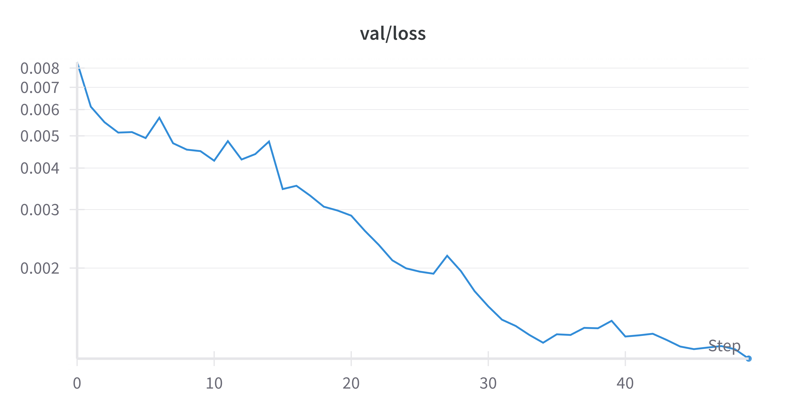

# Part 1: Modeling World Dynamics with Recurrent Neural Networks

## Task 1

- W&B Run: [qxd37jgl](https://wandb.ai/liblaf-team/hw2-part1-rnn/runs/qxd37jgl)
- Test Loss: `0.0011097531791569458`

###### Training Loss Over Epochs

###### Validation Loss Over Epochs

