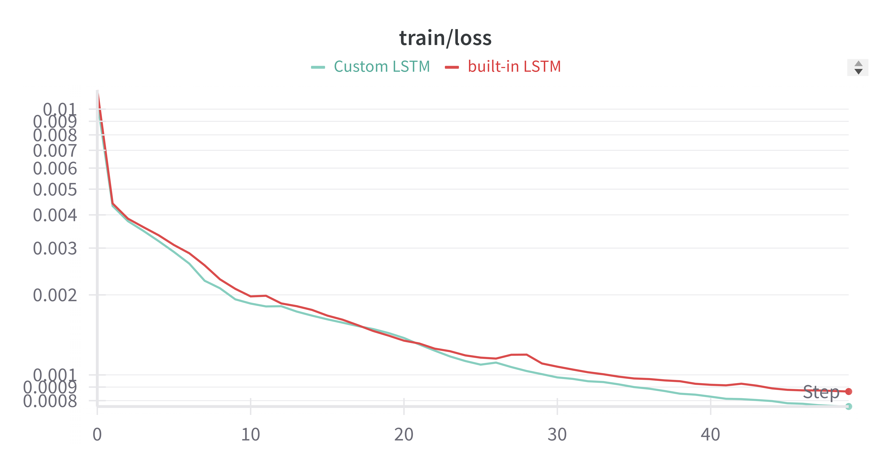

# Part 1: Modeling World Dynamics with Recurrent Neural Networks

## Task 1

- W&B Run: [ruby-wave-2](https://wandb.ai/liblaf-team/hw2-part1-rnn/runs/qxd37jgl)
- Test Loss: `0.0011097531791569458`

###### Training Loss Curve

###### Validation Loss Curve

## Task 2

- W&B Run: [still-terrain-7](https://wandb.ai/liblaf-team/hw2-part1-rnn/runs/2e9l432o)
- Test Loss: `0.0010881719515762394`

###### Training Loss Curve

###### Validation Loss Curve

