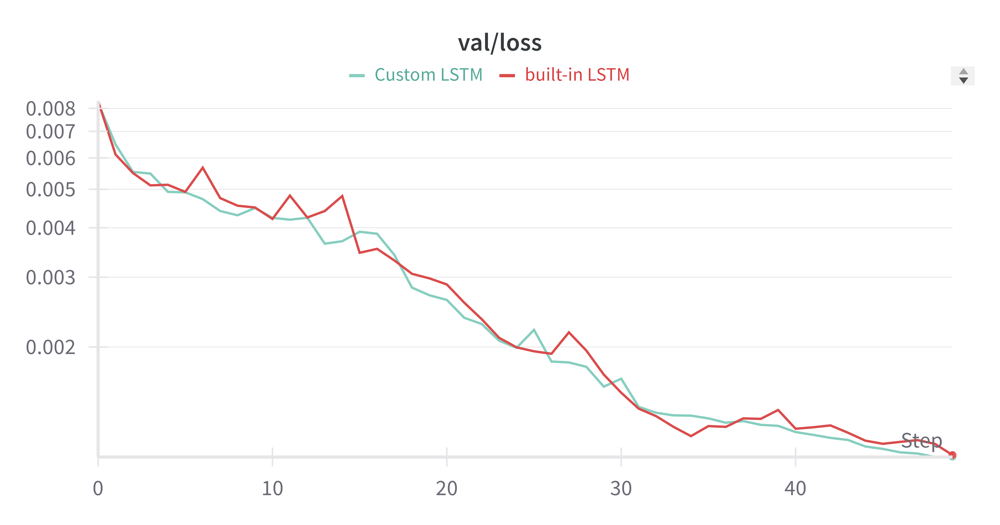

# Part 1: Modeling World Dynamics with Recurrent Neural Networks

## Task 1: Define and Train an LSTM-based World Model

### Implementation Details

The implementation used PyTorch's built-in `torch.nn.LSTM` layer. The LSTM model processes batched sequences of states and actions, outputting the predicted next state for each sequence in the batch.

#### Data Preprocessing

- Each observation from the CarRacing environment is initially a $200 \times 200$ RGB image.
- These images are downsampled to $32 \times 32$ to reduce computational load.
- The preprocessed images are combined with action vectors to form the inputs to the LSTM model.

#### Model Architecture

- **Input Layer**: The input consists of a concatenation of the flattened image tensor and the action vector.
- **LSTM Layer**: Captures temporal dependencies, crucial for effectively modeling sequence data.
- **Output Layer**: A linear layer transforms the LSTM hidden states into the predicted next state.

Here's the core implementation of the LSTM model architecture:

```python
class WorldModel(nn.Module):
    lstm: nn.LSTM
    decoder: nn.Linear

    def __init__(self, input_size: int, hidden_size: int, output_size: int) -> None:
        super().__init__()
        self.lstm = nn.LSTM(input_size=input_size, hidden_size=hidden_size)
        self.decoder = nn.Linear(hidden_size, output_size)

    def forward(
        self, state: BState, action: BAction, hidden: tuple[F1BH, F1BH]
    ) -> tuple[BO, tuple[F1BH, F1BH]]:
        batch_size: int = state.shape[0]
        state_size: int = state.numel() // batch_size
        action_size: int = action.numel() // batch_size
        input_tensor: BI = torch.hstack(
            [state.view(batch_size, state_size), action.view(batch_size, action_size)]
        )
        features, hidden = self.lstm(
            input_tensor.view(1, batch_size, input_size), hidden
        )
        next_state_pred = self.decoder(features.view(batch_size, -1))
        return next_state_pred, hidden
```

### Training Procedure

- **Optimizer**: Adam optimizer with a learning rate of 0.0003.
- **Loss Function**: Mean Squared Error (MSE) was used to measure the discrepancy between predicted and actual next states.
- **Training Duration**: The model was trained for 50 epochs.
- **Batch Size**: Set to 16.
- **Sequence Length**: Each input sequence to the model contained 10 time steps.

The model's training and validation losses over epochs can be observed in the plot below:

###### Training Loss


###### Validation Loss


### Results

- **Test Loss**: `0.0011097531791569458`.

The WandB run for this task can be viewed at [W&B Run](https://wandb.ai/liblaf-team/hw2-part1-rnn/runs/qxd37jgl).

## Task 2: Implement an LSTM Layer from Scratch

### Implementation Details

#### Custom LSTM Architecture

An LSTM cell consists of several components, primarily handling the various gates that regulate the flow of information:

- **Input Gate** ($i_t$): Controls how much of the new input information flows into the cell state.
- **Forget Gate** ($f_t$): Decides how much of the existing cell state information should be retained.
- **Output Gate** ($o_t$): Determines which parts of the cell state are output to the hidden state.
- **Cell State Update**: Integrates the new input and retained previous cell state information.

The mathematical equations for these transformations are:

$$
\begin{align*}
i_t &= \sigma(W_{xi} x_t + W_{hi} h_{t-1} + b_i) \\
f_t &= \sigma(W_{xf} x_t + W_{hf} h_{t-1} + b_f) \\
o_t &= \sigma(W_{xo} x_t + W_{ho} h_{t-1} + b_o) \\
\tilde{c}_t &= \tanh(W_{xc} x_t + W_{hc} h_{t-1} + b_c) \\
c_t &= f_t \cdot c_{t-1} + i_t \cdot \tilde{c}_t \\
h_t &= o_t \cdot \tanh(c_t)
\end{align*}
$$

#### Code Implementation

The LSTM layer was implemented manually by explicitly defining these operations within the `LSTM` class, handling input transformation, state updates, and gate activations.

```python
class LSTM(nn.Module):
    input_to_hidden: nn.Linear
    hidden_to_hidden: nn.Linear
    bias: nn.Parameter

    def __init__(self, input_size: int, hidden_size: int) -> None:
        super().__init__()
        self.input_to_hidden = nn.Linear(input_size, 4 * hidden_size, bias=False)
        self.hidden_to_hidden = nn.Linear(hidden_size, 4 * hidden_size, bias=False)
        self.bias = nn.Parameter(torch.zeros(4 * hidden_size))

    def forward(
        self,
        input: F1BI,
        hidden: tuple[F1BH, F1BH],
    ) -> tuple[BO, tuple[F1BH, F1BH]]:
        hidden_state, cell_state = hidden
        batch_size, input_size = input.shape[1], input.shape[-1]
        hidden_size = hidden_state.shape[-1]

        # Reshaping for batch processing
        input = input.view(batch_size, input_size)
        hidden_state = hidden_state.view(batch_size, hidden_size)
        cell_state = cell_state.view(batch_size, hidden_size)

        # LSTM gate operations
        activation = (
            self.input_to_hidden(input)
            + self.hidden_to_hidden(hidden_state)
            + self.bias
        )

        # Splitting and activating gates
        ai, af, ao, ag = torch.split(activation, [hidden_size] * 4, dim=1)
        input_gate = torch.sigmoid(ai)
        forget_gate = torch.sigmoid(af)
        output_gate = torch.sigmoid(ao)
        block_input = torch.tanh(ag)

        # Cell state and hidden state updates
        next_cell_state = forget_gate * cell_state + input_gate * block_input
        next_hidden_state = output_gate * torch.tanh(next_cell_state)

        return next_hidden_state, (
            next_hidden_state.view(1, batch_size, hidden_size),
            next_cell_state.view(1, batch_size, hidden_size),
        )
```

#### Model Training

The training loop for this custom LSTM was kept consistent with Task 1 to enable a fair performance comparison:

- **Optimizer**: Adam optimizer with a learning rate of 0.0003.
- **Loss Function**: Mean Squared Error (MSE) to measure prediction accuracy.
- **Epoch Count**: 50 epochs.
- **Batch Size**: 16.

### Results

The plot below shows the learning curves for both the custom and built-in LSTM models:

###### Training Loss


###### Validation Loss



- **Test Loss**: `0.0010881719515762394`.

The WandB run for this task can be viewed at [W&B Run](https://wandb.ai/liblaf-team/hw2-part1-rnn/runs/2e9l432o).

### Comparison with Built-in LSTM

The custom LSTM performed comparably to the built-in LSTM.

## Task 3: Evaluate Model with Two Rollout Strategies

### Experiment Setup

- **Selected Sequence**: A specific sequence from the test set was selected to evaluate both rollout strategies.
- **Steps Evaluated**: The rollout predictions span over 150 steps, allowing for a comprehensive comparison.
- **Comparison Metrics**: Predictions were visually compared with ground truth frames. Additionally, loss metrics were used to quantify accuracy across steps.

### Results and Observations

#### Visual Comparison

The following comparisons show predictions from both rollout strategies against ground truth over 10 steps:

- **Teacher Forcing Rollout**:
  - Generally maintains close alignment with ground truth frames because of accurate input information.
  - The model performs well initially but over longer sequences, the reliance on perfect data may mask potential compounding errors in sequential tasks.
- **Autoregressive Rollout**:
  - Starts with good alignment but gradually diverges as errors compound over successive steps.
  - Highlights the model's robustness (or lack thereof) in extrapolating future states from potentially imperfect data.

**Examples**:

| Step |                Ground Truth                |          Teacher Forcing Prediction           |              Autoregressive Prediction               |
|:----:|:------------------------------------------:|:---------------------------------------------:|:----------------------------------------------------:|
|  0   |  |  |  |
|  1   |  |  |  |
|  2   |  |  |  |
|  3   |  |  |  |
|  4   |  |  |  |
|  5   |  |  |  |
|  6   |  |  |  |
|  7   |  |  |  |
|  8   |  |  |  |
|  9   |  |  |  |

#### Quantitative Analysis

- **Error Accumulation**: Through MSE calculations over the sequence, the autoregressive approach showed increased error accumulation compared to teacher forcing.
- **Stability**: Teacher forcing provided stable predictions due to continuous corrections by true states, whereas autoregressive predictions were more prone to drift.


## Task 4: Question Answering

### Potential Improvements

#### 1. Incorporate Error-Feedback Mechanisms

**Approach**: Implement mechanisms where the model can learn from its past prediction errors by integrating a feedback loop during training.

- **Scheduled Sampling**: A technique that gradually transitions between teacher forcing and the model's own predictions during training. This method uses a probability schedule to decide whether each input will be the true data point or the model's predicted one. Scheduled Sampling mimics the test-time scenario during training, allowing the model to better handle the error propagation encountered in autoregressive sequences.

**Justification**: By gradually exposing the model to its own predictions during training, it learns to adjust to and recover from minor errors, reducing predictive drift over longer horizons. This approach effectively prepares the model for autoregressive scenarios without overly relying on perfect data inputs.

#### 2. Use a More Robust Model Architecture

**Approach**: Implement a more robust architecture incorporating mechanisms designed to maintain temporal coherence and manage large dependencies over time. Examples include:

- **Transformer Models**: Modern sequence prediction problems have benefited from transformer architectures that utilize attention mechanisms. Attention allows the model to focus on relevant parts of the sequence dynamically, which helps to mitigate error accumulation by emphasizing the sequence segments most pertinent to accurate predictions.
- **Encoder-Decoder Structures with Attention**: These architectures provide the capability to remember and learn long-term dependencies more efficiently, potentially reducing drift in open-loop prediction scenarios.

**Justification**: A transformer architecture captures long and short-term dependencies more effectively than traditional LSTMs. This is particularly beneficial in autoregressive rollouts as it enhances the model's ability to maintain prediction accuracy over longer sequences, even when preceding predictions contain small errors.

#### 3. Data Augmentation and Diversity Enhancements

**Approach**: Enhance the model's exposure to a diverse set of training sequences with augmented data that reflects a variety of conditions and errors.

- **Noise Injection**: Add controlled noise to input sequences during training to teach the model how to handle uncertain or imperfect data.
- **Synthetic Data Generation**: Generate synthetic sequences with known output behaviors to create scenarios reflecting diverse sequence dynamics and potential errors.

**Justification**: By training the model on diverse and noise-augmented data, it becomes more resilient to the variations and uncertainties inherent in real-world scenario predictions. This encourages learning generalized patterns rather than overfitting to the training dataset's limited scope.
