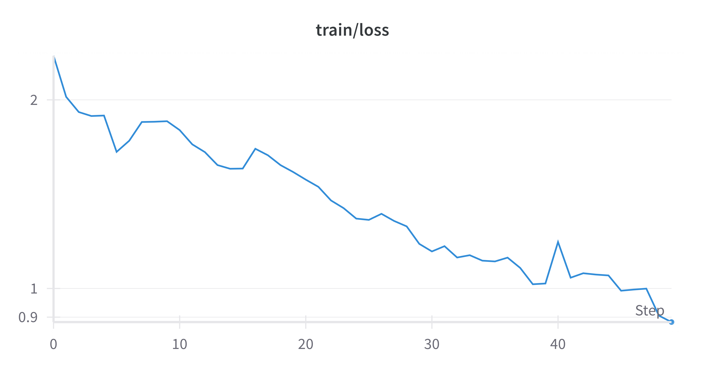

# Part Two: Graph Neural Networks (GNN)

## Task A: Graph Convolutional Networks (GCN), Graph Attention Networks (GAT), and GraphSAGE

### Results

|   Model   |     Test Loss      |  Test $R^2$ Score   |
| :-------: | :----------------: | :-----------------: |
|    GCN    | 0.8823628215789795 | 0.4510267972946167  |
|    GAT    | 0.9193381261825562 | 0.4280221462249756  |
| GraphSAGE | 0.8692418508529663 | 0.45919013023376465 |

### Training and Validation Loss Curves

###### Training Loss Curves


###### Validation Loss Curves


### Discussion

Among the three GNN architectures, GraphSAGE demonstrated the lowest test loss and the highest $R^2$ score, indicating it has a superior ability to predict dipole moments on the QM9 dataset compared to GCN and GAT. The choice of model architecture has significant implications on performance due to the different ways they integrate node feature information and handle graph topology.

### Links to W&B Runs

- [GCN Run](https://wandb.ai/liblaf-team/hw2-part2-gnn/runs/8lzblmvo)
- [GAT Run](https://wandb.ai/liblaf-team/hw2-part2-gnn/runs/itfxt0xa)
- [GraphSAGE Run](https://wandb.ai/liblaf-team/hw2-part2-gnn/runs/e42p8j8i)

## Task B: Implementing Graph Isomorphism Network (GIN)

In Task B, I chose to implement the Graph Isomorphism Network (GIN).

### Architecture Overview

GIN layers are designed to learn a function that captures complex node interactions by summing node features from neighboring nodes. The basic layer of GIN, the update function for node $i$, can be formulated as:

$$
h_v^{(k)} = \text{MLP}^{(k)}\left((1 + \epsilon^{(k)}) \cdot h_v^{(k-1)} + \sum_{u \in \mathcal{N}(v)} h_u^{(k-1)}\right)
$$

where $\text{MLP}$ is a multi-layer perceptron, $\epsilon$ is a learnable parameter, $h_v^{(k)}$ is the embedding of node $v$ at layer $k$, and $\mathcal{N}(v)$ represents the neighbors of node $v$.

### Core Implementation

The following code snippet encapsulates the core structure of the GIN model using PyTorch Geometric:

```python
class GIN(nn.Module):
    def __init__(self, num_node_features: int, hidden_dim: int = 64) -> None:
        super().__init__()
        # Using the PyG provided GINConv layer which internally uses a MLP as specified in the GIN paper.
        self.gin = tgnn.GIN(
            in_channels=num_node_features + 3, hidden_channels=hidden_dim, num_layers=7
        )
        self.lin = nn.Linear(hidden_dim, 1)

    @jaxtyped(typechecker=beartype.beartype)
    def forward(self, data: BatchData) -> Float[torch.Tensor, "batch_size 1"]:
        x: Float[torch.Tensor, "num_nodes in_channels=num_node_features+3"] = (
            torch.hstack([data.x, data.pos])
        )
        edge_index: Float[torch.Tensor, "2 num_edges"] = data.edge_index
        batch: Float[torch.Tensor, " num_nodes"] = data.batch
        x: Float[torch.Tensor, "num_nodes hidden_dim"] = self.gin(x, edge_index)
        x: Float[torch.Tensor, "batch_size hidden_dim"] = tgnn.global_mean_pool(
            x, batch
        )  # pyright: ignore [reportCallIssue]
        x: Float[torch.Tensor, "batch_size 1"] = self.lin(x)
        return x
```

### Results

After training the GIN model on the QM9 dataset, the model performance metrics were:

| Model |     Test Loss      |  Test $R^2$ Score  |
| :---: | :----------------: | :----------------: |
|  GIN  | 0.7374625625610352 | 0.5411783456802368 |

These results indicate that the GIN model outperforms the previously tested models, such as GCN, GAT, and GraphSAGE in Task A, in terms of both test loss and $R^2$ score.

### Analysis of Training and Validation Loss Curves

The training and validation loss curves demonstrate a convergence as the model is optimized. This indicates that the model is learning the patterns in the dataset effectively without overfitting. The plot below shows the progression of training loss over epochs.

###### Training Loss Curve



###### Validation Loss Curve


### Conclusion

The implementation and evaluation of GIN illustrated its strength in predicting molecular properties, particularly the dipole moment in the QM9 dataset. The expression power of GIN, attributed to its learnable MLP and parameter $\epsilon$, allows it to capture complex relationships in graph data, making it a suitable choice for tasks involving molecular graphs.

### Link to W&B Run

- [GIN Run](https://wandb.ai/liblaf-team/hw2-part2-gnn/runs/00iegpc8)
