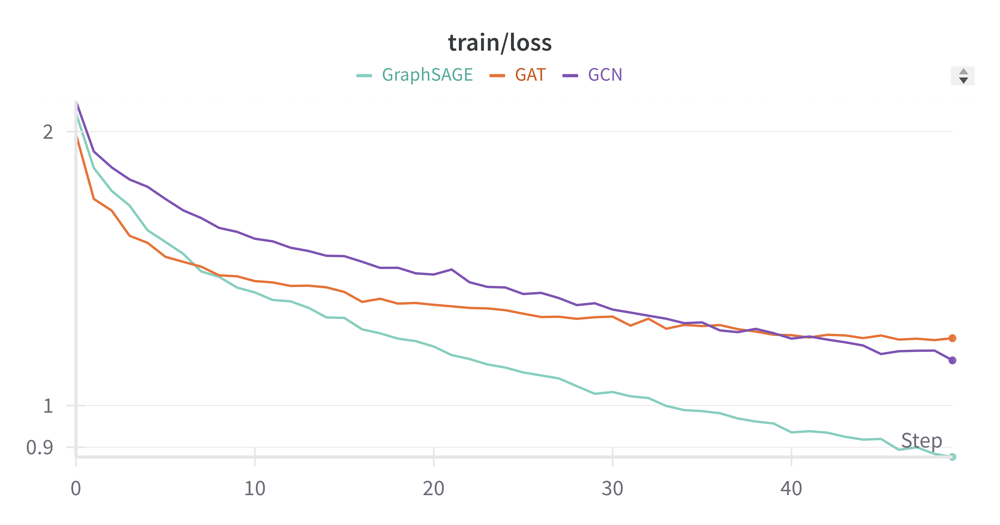

# Part Two: Graph Neural Networks (GNN)

## Task A

###### Training Loss Curve

###### Validation Loss Curve

### Test Loss

| Model     | Test Loss          | Test R2 Score       |
| --------- | ------------------ | ------------------- |
| GCN       | 0.8823628215789795 | 0.4510267972946167  |
| GAT       | 0.9193381261825562 | 0.4280221462249756  |
| GraphSAGE | 0.8692418508529663 | 0.45919013023376465 |
