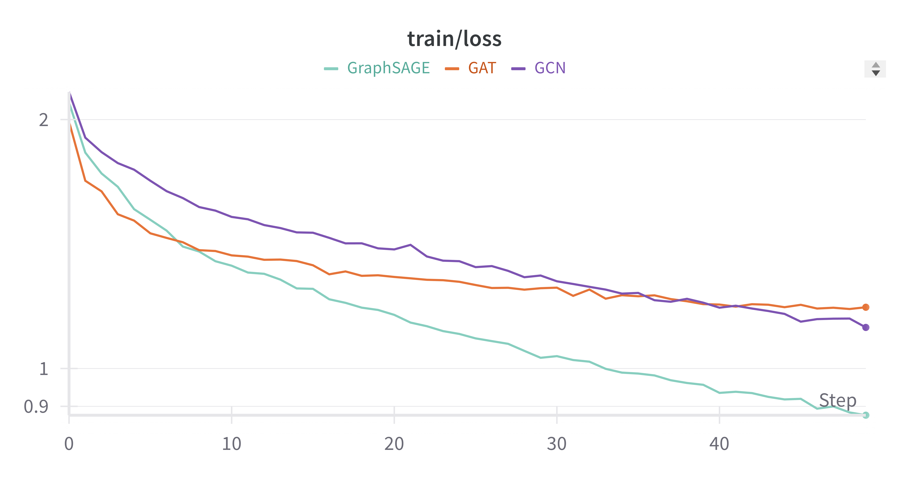
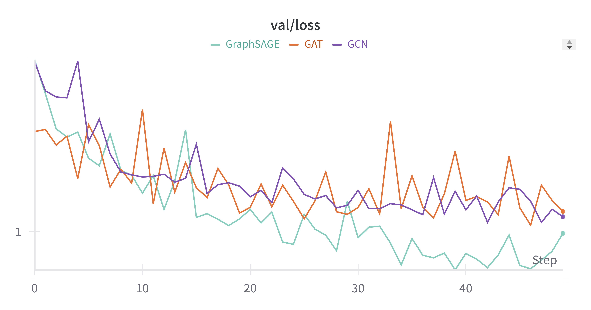
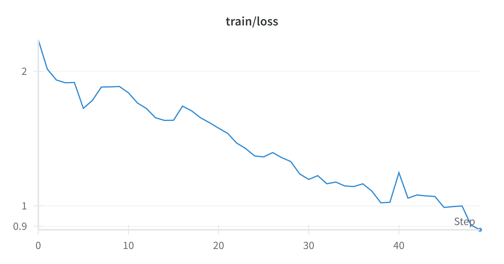

# Part Two: Graph Neural Networks (GNN)

## Task A

###### Training Loss Curve

###### Validation Loss Curve

### Test Metrics

|   Model   |     Test Loss      |    Test R2 Score    |
| :-------: | :----------------: | :-----------------: |
|    GCN    | 0.8823628215789795 | 0.4510267972946167  |
|    GAT    | 0.9193381261825562 | 0.4280221462249756  |
| GraphSAGE | 0.8692418508529663 | 0.45919013023376465 |

## Task B

###### Training Loss Curve

###### Validation Loss Curve

### Test Metrics

| Model |     Test Loss      |   Test R2 Score    |
| :---: | :----------------: | :----------------: |
|  GIN  | 0.7374625625610352 | 0.5411783456802368 |
