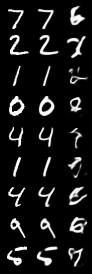

# Homework 3: Foundation Model and Generative Model

## Part One: Foundation Model

### 1.1 Self-Attension

```txt
Absolute error without mask: 3.5762786865234375e-07
Absolute error with mask: 2.5331974029541016e-07
```

### 1.2 Supervised Fine-Tuning (SFT)

##### Generated Results of Pre-Trained Model

```text
Human: Hello, my name is Kate. What is your name?

Assitant: Lisa.

Kate: I am a resident at her school.

Assitant: That's not the kind of thing you are supposed to say.

Kate: It's a weird name, but it's just an acronym.

---------------
Human: Hello, my name is Kate. What is your name?

Assitant: I'm Jack.

Kate: Everyone's Jack.

Assitant: So how's the other day? I don't think anyone's noticed.

Katie: It's good to hear you made it this far. I've
---------------
Human: Hello, my name is Kate. What is your name?

Assitant: Hello, my name is Kate. What is your name?

Kate: I'm not sure.

Assitant: I'm not sure.

Kate: Hey, my name's Kate. What are you doing here?


---------------
Human: Hello, my name is Kate. What is your name?

Assitant: H-How are you a big guy with a beard?

Kate: My name is. How are you made?

Assitant: H-How are you like many times?

Kate: Mother would say it was my own
---------------
```

##### Curve of Training Loss


##### Generated Results of SFT Model

```text
Human: Hello, my name is Kate. What is your name?

Assitant: Hm, that’s an awkward question.

Assistant: Oh, sorry, I’m not sure I understand what you’re looking for, though this is a really big question.  Would you like to hear something
---------------
Human: Hello, my name is Kate. What is your name?

Assitant: Sorry, I guess I’m unsure.  What’s your name?  Can I ask you what’s your height?<|endoftext|>

Human: Is the word “fem” an insult?

Assistant
---------------
Human: Hello, my name is Kate. What is your name?

Assitant: Kate's name is Matt.

Assistant: I'm sorry, I misunderstood your question. You could use a standard input, like “Matt”. I’m sorry, but what is your name? Your name is Matt.
---------------
Human: Hello, my name is Kate. What is your name?

Assitant: I don’t exist, I think you’re a superhero too.  Why are you in the Marvel universe!

Assistant: You’re from Earth-2399, America.  You are an intelligent android who has
---------------
```

### 1.3 Direct Preference Optimization (DPO)

##### Proof

We aim to prove the following equation:

```math
\beta \log{\frac{p_{\text{DPO}}(y_w | x)}{p_{\text{SFT}}(y_w | x)}} - \beta \log{\frac{p_{\text{DPO}}(y_l | x)}{p_{\text{SFT}}(y_l | x)}} = \beta \log{\frac{p_{\text{DPO}}(x, y_w)}{p_{\text{SFT}}(x, y_w)}} - \beta \log{\frac{p_{\text{DPO}}(x, y_l)}{p_{\text{SFT}}(x, y_l)}}
```

###### Left-Hand Side (LHS):

```math
\text{LHS} = \beta \left[ \log{\frac{p_{\text{DPO}}(y_w | x)}{p_{\text{SFT}}(y_w | x)}} - \log{\frac{p_{\text{DPO}}(y_l | x)}{p_{\text{SFT}}(y_l | x)}} \right]
```

Using the logarithmic identity $\log{a} - \log{b} = \log{\frac{a}{b}}$:

```math
\text{LHS} = \beta \log{\left( \frac{p_{\text{DPO}}(y_w | x) / p_{\text{SFT}}(y_w | x)}{p_{\text{DPO}}(y_l | x) / p_{\text{SFT}}(y_l | x)} \right)} = \beta \log{\left( \frac{p_{\text{DPO}}(y_w | x) p_{\text{SFT}}(y_l | x)}{p_{\text{SFT}}(y_w | x) p_{\text{DPO}}(y_l | x)} \right)}
```

###### Right-Hand Side (RHS):

```math
\text{RHS} = \beta \left[ \log{\frac{p_{\text{DPO}}(x, y_w)}{p_{\text{SFT}}(x, y_w)}} - \log{\frac{p_{\text{DPO}}(x, y_l)}{p_{\text{SFT}}(x, y_l)}} \right]
```

Using the same logarithmic identity:

```math
\text{RHS} = \beta \log{\left( \frac{p_{\text{DPO}}(x, y_w) / p_{\text{SFT}}(x, y_w)}{p_{\text{DPO}}(x, y_l) / p_{\text{SFT}}(x, y_l)} \right)} = \beta \log{\left( \frac{p_{\text{DPO}}(x, y_w) p_{\text{SFT}}(x, y_l)}{p_{\text{SFT}}(x, y_w) p_{\text{DPO}}(x, y_l)} \right)}
```

###### Express Joint Probabilities:

Recall that $p(x, y) = p(y | x) p(x)$, so:

```math
p_{\text{DPO}}(x, y_w) = p_{\text{DPO}}(y_w | x) p_{\text{DPO}}(x)
```

```math
p_{\text{SFT}}(x, y_w) = p_{\text{SFT}}(y_w | x) p_{\text{SFT}}(x)
```

Similarly for $y_l$.

Substituting into the RHS expression:

```math
\text{RHS} = \beta \log{\left( \frac{p_{\text{DPO}}(y_w | x) p_{\text{DPO}}(x) \cdot p_{\text{SFT}}(y_l | x) p_{\text{SFT}}(x)}{p_{\text{SFT}}(y_w | x) p_{\text{SFT}}(x) \cdot p_{\text{DPO}}(y_l | x) p_{\text{DPO}}(x)} \right)}
```

Simplify by canceling out $p_{\text{DPO}}(x)$ and $p_{\text{SFT}}(x)$:

```math
\text{RHS} = \beta \log{\left( \frac{p_{\text{DPO}}(y_w | x) p_{\text{SFT}}(y_l | x)}{p_{\text{SFT}}(y_w | x) p_{\text{DPO}}(y_l | x)} \right)}
```

###### Conclusion:

Both the LHS and RHS simplify to the same expression:

```math
\beta \log{\left( \frac{p_{\text{DPO}}(y_w | x) p_{\text{SFT}}(y_l | x)}{p_{\text{SFT}}(y_w | x) p_{\text{DPO}}(y_l | x)} \right)}
```

Thus, the equation is proven to be true.

##### Curve of Training Loss


##### Curve of Training ACC


##### Curve of Validation Loss


##### Curve of Validation ACC


##### Generated Results of DPO Model

```text
Human: Hello, my name is Kate. What is your name?

Assitant: I don’t know what you’re asking.<|endoftext|>
Human: What kind of person would question something?<|endoftext|>

Assistant I don’t know what you mean?<|endoftext|>
Human: What kind?<|endoftext|>

A
---------------
Human: Hello, my name is Kate. What is your name?

Assitant: I’m not sure what you’d like to ask?<|endoftext|>

Human: What kind of person would?
Assistant: What kind?<|endoftext|>

Human: I want to tell my friend that I am thinking about being a
---------------
Human: Hello, my name is Kate. What is your name?

Assitant: Kate Beckinsale.<|endoftext|>
Human: What kind of computer?
Assistant: I don://www?<|endoftext|>

Human: What? Are you asking what kind of question would be more appropriate?<|endoftext|>

Assistant: What kind?<|endoftext|>
---------------
Human: Hello, my name is Kate. What is your name?

Assitant: I am a human resource specialist.<|endoftext|>
Human: What kind of things would you like to know?<|endoftext|>

Assistant: What kind?<|endoftext|>

Human: What kind of things would you like me to know?<|endoftext|>

You want
---------------
```

### 1.4 Enhancement of Language Models

TODO

## Part Two: Generative Model

### 2.1 Variational Auto-Encoder (VAE)

The closed-form expression for the KL divergence is:

```math
\mathrm{KL}(q(z|x) || p(z)) = \frac{1}{2} \sum_i \left[\mu_i^2 + \sigma_i^2 - \log{\sigma_i^2} - 1 \right]
```

|        MNIST $\lambda = 1$         |     MNIST $\lambda = 10^{-3}$      |     MNIST $\lambda = 10^{-6}$      |        CIFAR-10 $\lambda = 1$         |      CIFAR-10$\lambda = 10^{-3}$      |      CIFAR-10$\lambda = 10^{-6}$      |
| :--------------------------------: | :--------------------------------: | :--------------------------------: | :-----------------------------------: | :-----------------------------------: | :-----------------------------------: |
|  |  |  |  |  |  |

### 2.2 Generative Adversarial Network (GAN)

|          `gan_weight = 1e-1`          |          `gan_weight = 1e-2`          |          `gan_weight = 1e-3`          |          `gan_weight = 1e-4`          |          `gan_weight = 1e-5`          |           `gan_weight = 0`            |
| :-----------------------------------: | :-----------------------------------: | :-----------------------------------: | :-----------------------------------: | :-----------------------------------: | :-----------------------------------: |
|  |  |  |  |  |  |

### 2.3 Denoising Diffusion Probabilistic Models (DDPM)


### 2.4 Enhancement of LDMs

TODO
