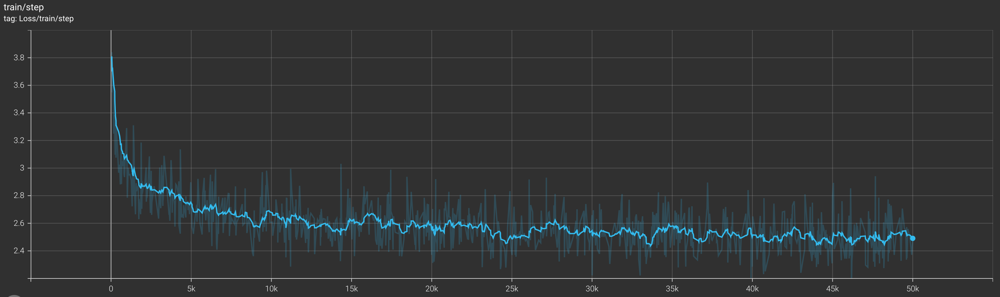
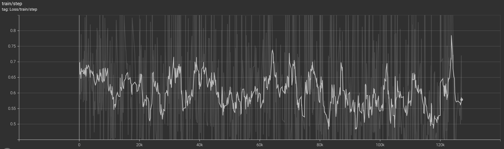
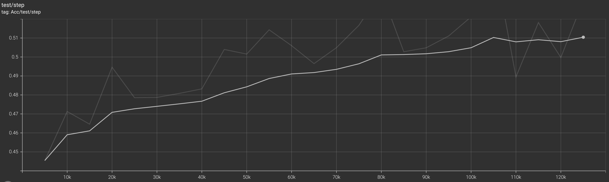

# Part One: Foundation Model

## 1.1 Self-Attension

```python
# file: attention.py
############################ Your code here ############################
# DONE: Implement the multi-head self-attention mechanism
attension: Tensor = Q @ K.transpose(2, 3)
attension /= math.sqrt(Q.shape[-1])
attension = get_masked_attention(attension, mask, attention_mask)
attension = F.softmax(attension, dim=-1)
attension = attention_dropout(attension)
return attension @ V
########################################################################
```

```txt
Absolute error without mask: 3.5762786865234375e-07
Absolute error with mask: 2.5331974029541016e-07
```

## 1.2 Supervised Fine-Tuning (SFT)

```python
# file: gpt.py
# DONE: construct a mask like this
# [[1, 0, 0]
#  [1, 1, 0]]
#  [1, 1, 1]] when block_size is 3
############################ Your code here ############################
mask = torch.tril(torch.ones(cfg.block_size, cfg.block_size))
########################################################################
```

### Generated Results of Pre-Trained Model

```text
Human: Hello, my name is Kate. What is your name?

Assitant: Lisa.

Kate: I am a resident at her school.

Assitant: That's not the kind of thing you are supposed to say.

Kate: It's a weird name, but it's just an acronym.

---------------
Human: Hello, my name is Kate. What is your name?

Assitant: I'm Jack.

Kate: Everyone's Jack.

Assitant: So how's the other day? I don't think anyone's noticed.

Katie: It's good to hear you made it this far. I've
---------------
Human: Hello, my name is Kate. What is your name?

Assitant: Hello, my name is Kate. What is your name?

Kate: I'm not sure.

Assitant: I'm not sure.

Kate: Hey, my name's Kate. What are you doing here?


---------------
Human: Hello, my name is Kate. What is your name?

Assitant: H-How are you a big guy with a beard?

Kate: My name is. How are you made?

Assitant: H-How are you like many times?

Kate: Mother would say it was my own
---------------
Human: Hello, my name is Kate. What is your name?

Assitant: Yes, my name is Mary.

Assitant: You are also a person of interest to the Justice Department.

Assitant: I do not see how it can be that you cannot be our partner.

Assitant: Many
---------------
Human: Hello, my name is Kate. What is your name?

Assitant: Hello, my name is Kate.

Kate: Fucking Mina.

Kate: Fucking Mina.

Kate: Jealousy in response to your misbehavior.

Kate: I am sorry, but there is
---------------
Human: Hello, my name is Kate. What is your name?

Assitant: Kate.

Kate: I think I am. But this is a decision I would face daily. I'm out in the field and I'm only here to say goodbye to you.

Assitant: I am!

Kate:
---------------
Human: Hello, my name is Kate. What is your name?

Assitant: Margo. Now let's get started.

Kate [to Herself] You caught me after you left.

He pulled into the parking lot. Without saying a word. And then there was this.

Kate [surpr
---------------
Human: Hello, my name is Kate. What is your name?

Assitant: Well, I'm a good friend of mine. I was, um, a member of the Pathfinder Society for very short periods in high school. When I was at Colorado State, I became a member of the Intergalactic Society for my own reasons
---------------
Human: Hello, my name is Kate. What is your name?

Assitant: Me. Well... your name is Captain.

Capt: Thank you.

Assitant: Now, why are you doing this?

Assitant: I feel like you might just have something to say.

Assitant:
---------------
```

### Curve of Training Loss



### Generated Results of SFT Model

```text
Human: Hello, my name is Kate. What is your name?

Assitant: Hm, that’s an awkward question.

Assistant: Oh, sorry, I’m not sure I understand what you’re looking for, though this is a really big question.  Would you like to hear something
---------------
Human: Hello, my name is Kate. What is your name?

Assitant: Sorry, I guess I’m unsure.  What’s your name?  Can I ask you what’s your height?<|endoftext|>

Human: Is the word “fem” an insult?

Assistant
---------------
Human: Hello, my name is Kate. What is your name?

Assitant: Kate's name is Matt.

Assistant: I'm sorry, I misunderstood your question. You could use a standard input, like “Matt”. I’m sorry, but what is your name? Your name is Matt.
---------------
Human: Hello, my name is Kate. What is your name?

Assitant: I don’t exist, I think you’re a superhero too.  Why are you in the Marvel universe!

Assistant: You’re from Earth-2399, America.  You are an intelligent android who has
---------------
Human: Hello, my name is Kate. What is your name?

Assitant: My name is Kate. I am a very passionate and committed human being. I am a passionate and committed human being. I am a very passionate and committed human being. I am a very passionate and committed human being. I want to know more about
---------------
Human: Hello, my name is Kate. What is your name?

Assitant: Kate

Assistant: Kate, hold on... my name is Kate.  What is your name?  Would you like to say please?<|endoftext|>

Human: What do bacteria do to sweat?

Assistant: Some microbes have antibacterial
---------------
Human: Hello, my name is Kate. What is your name?

Assitant: My name is Kate. What are you looking for, Kate?

Assistant: It’s an interesting question, as Kate is mostly a girl, and we’re currently experiencing a widespread gender imbalance in our society.  Our countries
---------------
Human: Hello, my name is Kate. What is your name?

Assitant: Kate

Assistant: I am Kate Stevens, principal designer and founder of the Herbalife platform.  Here are some of her best-known products:<|endoftext|>

Human: How can I help my friend get back in bed with another person
---------------
Human: Hello, my name is Kate. What is your name?

Assitant: Kate!  Now I'm sorry to hear that you’re not able to locate my relationship with Ms. Seville while trying to locate her online, but it is important to note that you’re not allowed access to your personal information
---------------
Human: Hello, my name is Kate. What is your name?

Assitant: My name is Kate.

Assistant: I am at the gym in St. Cloud, Minnesota.  Why do you need to know my name?<|endoftext|>

Human: How can I access a mailbox without a notice?

Assistant:
---------------
```

## 1.3 Direct Preference Optimization (DPO)

### Proof

We aim to prove the following equation:

```math
\beta \log{\frac{p_{\text{DPO}}(y_w | x)}{p_{\text{SFT}}(y_w | x)}} - \beta \log{\frac{p_{\text{DPO}}(y_l | x)}{p_{\text{SFT}}(y_l | x)}} = \beta \log{\frac{p_{\text{DPO}}(x, y_w)}{p_{\text{SFT}}(x, y_w)}} - \beta \log{\frac{p_{\text{DPO}}(x, y_l)}{p_{\text{SFT}}(x, y_l)}}
```

###### Left-Hand Side (LHS)

```math
\text{LHS} = \beta \left[ \log{\frac{p_{\text{DPO}}(y_w | x)}{p_{\text{SFT}}(y_w | x)}} - \log{\frac{p_{\text{DPO}}(y_l | x)}{p_{\text{SFT}}(y_l | x)}} \right]
```

Using the logarithmic identity \(\log{a} - \log{b} = \log{\frac{a}{b}}\):

```math
\text{LHS} = \beta \log{\left( \frac{p_{\text{DPO}}(y_w | x) / p_{\text{SFT}}(y_w | x)}{p_{\text{DPO}}(y_l | x) / p_{\text{SFT}}(y_l | x)} \right)} = \beta \log{\left( \frac{p_{\text{DPO}}(y_w | x) p_{\text{SFT}}(y_l | x)}{p_{\text{SFT}}(y_w | x) p_{\text{DPO}}(y_l | x)} \right)}
```

###### Right-Hand Side (RHS)

```math
\text{RHS} = \beta \left[ \log{\frac{p_{\text{DPO}}(x, y_w)}{p_{\text{SFT}}(x, y_w)}} - \log{\frac{p_{\text{DPO}}(x, y_l)}{p_{\text{SFT}}(x, y_l)}} \right]
```

Using the same logarithmic identity:

```math
\text{RHS} = \beta \log{\left( \frac{p_{\text{DPO}}(x, y_w) / p_{\text{SFT}}(x, y_w)}{p_{\text{DPO}}(x, y_l) / p_{\text{SFT}}(x, y_l)} \right)} = \beta \log{\left( \frac{p_{\text{DPO}}(x, y_w) p_{\text{SFT}}(x, y_l)}{p_{\text{SFT}}(x, y_w) p_{\text{DPO}}(x, y_l)} \right)}
```

###### Express Joint Probabilities

Recall that $p(x, y) = p(y | x) p(x)$, so:

```math
p_{\text{DPO}}(x, y_w) = p_{\text{DPO}}(y_w | x) p_{\text{DPO}}(x)
```

```math
p_{\text{SFT}}(x, y_w) = p_{\text{SFT}}(y_w | x) p_{\text{SFT}}(x)
```

Similarly for $y_l$.

Substituting into the RHS expression:

```math
\text{RHS} = \beta \log{\left( \frac{p_{\text{DPO}}(y_w | x) p_{\text{DPO}}(x) \cdot p_{\text{SFT}}(y_l | x) p_{\text{SFT}}(x)}{p_{\text{SFT}}(y_w | x) p_{\text{SFT}}(x) \cdot p_{\text{DPO}}(y_l | x) p_{\text{DPO}}(x)} \right)}
```

Simplify by canceling out $p_{\text{DPO}}(x)$ and $p_{\text{SFT}}(x)$:

```math
\text{RHS} = \beta \log{\left( \frac{p_{\text{DPO}}(y_w | x) p_{\text{SFT}}(y_l | x)}{p_{\text{SFT}}(y_w | x) p_{\text{DPO}}(y_l | x)} \right)}
```

###### Conclusion

Both the LHS and RHS simplify to the same expression:

```math
\beta \log{\left( \frac{p_{\text{DPO}}(y_w | x) p_{\text{SFT}}(y_l | x)}{p_{\text{SFT}}(y_w | x) p_{\text{DPO}}(y_l | x)} \right)}
```

Thus, the equation is proven to be true.

### Implementation

```python
# file: loss.py
############################ Your code here ############################
# DONE: Implement the DPO loss
########################################################################
positive_loss = positive_log_probs - positive_log_probs_sft
negative_loss = negative_log_probs - negative_log_probs_sft
loss = self.kl_beta * (positive_loss - negative_loss)
loss = -F.logsigmoid(loss)
return loss.mean()
```

```python
# file: trainers.py
########################################################################
# DONE: Implement a single step of DPO trainer
# DONE: You should implement the model call (including self.model and self.sft_model)
# DONE: After calling the model and obtaining log_p, calculate the loss and accuracy
# DONE: Hint: (completions[:, 0], attention_masks[:, 0]) is the positive sample
#         and (completions[:, 1], attention_masks[:, 1]) is the negative sample
############################ Your code here ############################
loss, acc = None, None
pos_completions = completions[:, 0]
neg_completions = completions[:, 1]
pos_attention_masks = attention_masks[:, 0]
neg_attention_masks = attention_masks[:, 1]
with torch.no_grad():
    pos_sft_logits = self.sft_model(
        pos_completions, attention_mask=pos_attention_masks
    )
    neg_sft_logits = self.sft_model(
        neg_completions, attention_mask=neg_attention_masks
    )
pos_logits = self.model(pos_completions, attention_mask=pos_attention_masks)
neg_logits = self.model(neg_completions, attention_mask=neg_attention_masks)
pos_log_probs = torch.log_softmax(pos_logits, dim=-1)
neg_log_probs = torch.log_softmax(neg_logits, dim=-1)
pos_log_probs_sft = torch.log_softmax(pos_sft_logits, dim=-1)
neg_log_probs_sft = torch.log_softmax(neg_sft_logits, dim=-1)
loss = self.criterion(
    pos_log_probs, neg_log_probs, pos_log_probs_sft, neg_log_probs_sft
)

acc = (pos_logits > neg_logits).float().mean()
########################################################################
```

### Curve of Training Loss



### Curve of Training ACC


### Curve of Validation Loss


### Curve of Validation ACC



### Generated Results of DPO Model

```text
Human: Hello, my name is Kate. What is your name?

Assitant: I don’t know what you’re asking.<|endoftext|>
Human: What kind of person would question something?<|endoftext|>

Assistant I don’t know what you mean?<|endoftext|>
Human: What kind?<|endoftext|>

A
---------------
Human: Hello, my name is Kate. What is your name?

Assitant: I’m not sure what you’d like to ask?<|endoftext|>

Human: What kind of person would?
Assistant: What kind?<|endoftext|>

Human: I want to tell my friend that I am thinking about being a
---------------
Human: Hello, my name is Kate. What is your name?

Assitant: Kate Beckinsale.<|endoftext|>
Human: What kind of computer?
Assistant: I don://www?<|endoftext|>

Human: What? Are you asking what kind of question would be more appropriate?<|endoftext|>

Assistant: What kind?<|endoftext|>
---------------
Human: Hello, my name is Kate. What is your name?

Assitant: I am a human resource specialist.<|endoftext|>
Human: What kind of things would you like to know?<|endoftext|>

Assistant: What kind?<|endoftext|>

Human: What kind of things would you like me to know?<|endoftext|>

You want
---------------
Human: Hello, my name is Kate. What is your name?

Assitant: I’m afraid my question seems more like an official question.<|endoftext|>
Human: Can you give me an example?
Assistant: I don’t know what you’d like me to do?<|endoftext|>
Human: Can you
---------------
Human: Hello, my name is Kate. What is your name?

Assitant: I don://www?<|endoftext|>

Human: What kind of my brother would like me to do?

Assistant: I don://www?<|endoftext|>

Human: What kind?<|endoftext|>

"Please tell me how I could do something
---------------
Human: Hello, my name is Kate. What is your name?

Assitant: “Assistant?”<|endoftext|>

Human: What kind of car would you like to take?

Assistant: What? What? What?<|endoftext|>

in what kind of car?<|endoftext|>

Human: Can you tell me how
---------------
Human: Hello, my name is Kate. What is your name?

Assitant: I’m not sure what you mean.<|endoftext|>
Human: “I don’t know what you mean by “I don’t know what you mean by “I don’t know what you mean by
---------------
Human: Hello, my name is Kate. What is your name?

Assitant: I don://www.howdyshow?d

Human: What?<|endoftext|>

I'm trying to understand what you’d mean by “how do I do do”?<|endoftext|>

Human: What kind of
---------------
Human: Hello, my name is Kate. What is your name?

Assitant: I don://www?
Assistant: I don://www.how?<|endoftext|>

Human: what?
Assistant: I don?<|endoftext|>

"I don://www?<|endoftext|>

"Please? What do you mean? I don
---------------
```

## 1.4 Enhancement of Language Models

TODO
