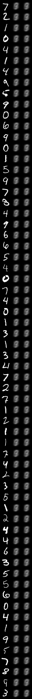
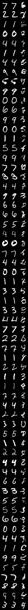
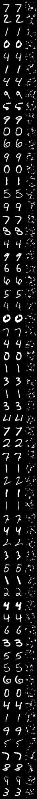
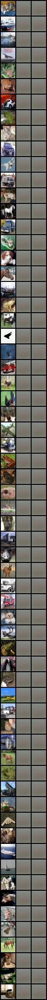
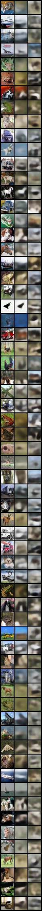
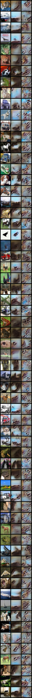
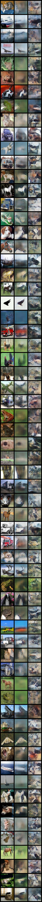
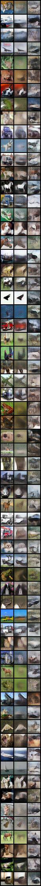
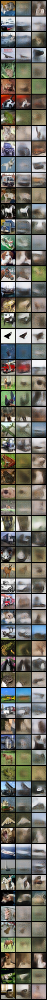

# Part Two: Generative Model

## 2.1 Variational Auto-Encoder (VAE)

The closed-form expression for the KL divergence is:

```math
\mathrm{KL}(q(z|x) || p(z)) = \frac{1}{2} \sum_i \left[\mu_i^2 + \sigma_i^2 - \log{\sigma_i^2} - 1 \right]
```

```python
num_epochs: int = 10
kl_weight: float = 1e-3 # 1.0, 1e-6
gan_weight: float = 0.0
gan_loss_start: int = 0
num_visualization: int = 1
lr: float = 3e-4
grad_clip: float = 0.0
```

|    MNIST $\lambda = 1$     | MNIST $\lambda = 10^{-3}$  | MNIST $\lambda = 10^{-6}$  |    CIFAR-10 $\lambda = 1$     |  CIFAR-10$\lambda = 10^{-3}$  |  CIFAR-10$\lambda = 10^{-6}$  |
| :------------------------: | :------------------------: | :------------------------: | :---------------------------: | :---------------------------: | :---------------------------: |
|  |  |  |  |  |  |

## 2.2 Generative Adversarial Network (GAN)

```python
num_epochs: int = 10
kl_weight: float = 1e-3
gan_weight: float = 1e-3
gan_loss_start: int = 1
num_visualization: int = 1
lr: float = 3e-4
grad_clip: float = 0.0
```

|      `gan_weight = 1e-1`      |      `gan_weight = 1e-2`      |      `gan_weight = 1e-3`      |      `gan_weight = 1e-4`      |      `gan_weight = 1e-5`      |       `gan_weight = 0`        |
| :---------------------------: | :---------------------------: | :---------------------------: | :---------------------------: | :---------------------------: | :---------------------------: |
|  |  |  |  |  |  |

## 2.3 Denoising Diffusion Probabilistic Models (DDPM)



## 2.4 Enhancement of LDMs

TODO
