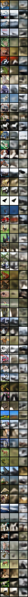

# Part Two: Generative Model

## 2.1 Variational Auto-Encoder (VAE)

The closed-form expression for the KL divergence is:

```math
\mathrm{KL}(q(z|x) || p(z)) = \frac{1}{2} \sum_i \left[\mu_i^2 + \sigma_i^2 - \log{\sigma_i^2} - 1 \right]
```

```python
# file: loss.py
############################ Your code here ############################
# DONE: compute the KL divergence loss for q(z|x) and p(z)
# DONE: q(z|x) ~ N(mu, exp(logvar)), p(z) ~ N(0, 1)
########################################################################
kl_divergence = 0.5 * torch.sum(
    mu**2 + torch.exp(logvar) - logvar - 1, dim=tuple(range(1, mu.ndim))
)
########################################################################
```

```python
# file: model.py
############################ Your code here ############################
# DONE: implement the reparameterization trick to obtain latent z
########################################################################
std = torch.exp(0.5 * logvar)
eps = torch.randn_like(std)
z = mu + eps * std
########################################################################
```

|    MNIST $\lambda = 1$     | MNIST $\lambda = 10^{-3}$  | MNIST $\lambda = 10^{-6}$  |    CIFAR-10 $\lambda = 1$     |  CIFAR-10$\lambda = 10^{-3}$  |  CIFAR-10$\lambda = 10^{-6}$  |
| :------------------------: | :------------------------: | :------------------------: | :---------------------------: | :---------------------------: | :---------------------------: |
|  |  |  |  |  |  |

## 2.2 Generative Adversarial Network (GAN)

```python
# file: loss.py
############################ Your code here ############################
# DONE: compute the Hinge GAN loss for the discriminator
########################################################################
real = torch.mean(real, dim=tuple(range(1, real.ndim)))
fake = torch.mean(fake, dim=tuple(range(1, fake.ndim)))
loss = 0.5 * (F.relu(1 - real) + F.relu(1 + fake))
########################################################################
```

```python
# file: loss.py
############################ Your code here ############################
# DONE: compute the GAN loss for the generator
########################################################################
fake = torch.mean(fake, dim=tuple(range(1, fake.ndim)))
loss = -fake
########################################################################
```

|      `gan_weight = 1e-1`      |      `gan_weight = 1e-2`      |      `gan_weight = 1e-3`      |      `gan_weight = 1e-4`      |      `gan_weight = 1e-5`      |       `gan_weight = 0`        |
| :---------------------------: | :---------------------------: | :---------------------------: | :---------------------------: | :---------------------------: | :---------------------------: |
|  |  |  |  |  |  |

## 2.3 Denoising Diffusion Probabilistic Models (DDPM)

```python
# file: diffusion.py
############################ Your code here ############################
# DONE: sample from q(x_t | x_0) with given x_0 and noise
# DONE: hint: use extract function
########################################################################
return (
    extract(self.sqrt_alphas_cumprod, t, x_start.shape) * x_start
    + extract(self.sqrt_one_minus_alphas_cumprod, t, x_start.shape) * noise
)
########################################################################
```

```python
# file: diffusion.py
############################ Your code here ############################
# DONE: sample from the model
# DONE: initially x_T = N(0, 1)
# DONE: iterative sampling from p(x_{t-1} | x_t) until t == 0
########################################################################
img = torch.randn(shape, device=self.betas.device)
for i in reversed(range(0, self.num_timesteps)):
    img = self.p_sample(
        denoise_fn,
        img,
        y,
        torch.full((b,), i, device=self.betas.device, dtype=torch.long),
    )
########################################################################
```


## 2.4 Enhancement of LDMs

TODO
